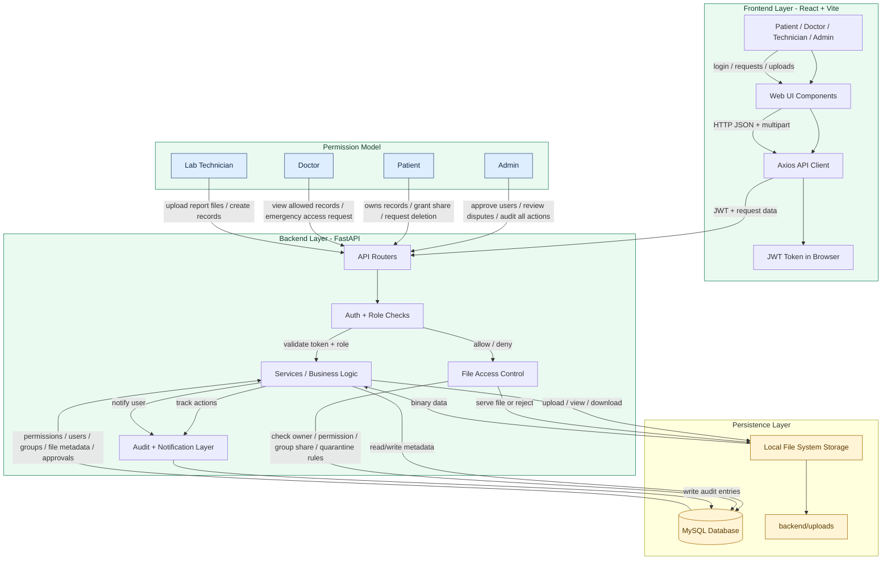
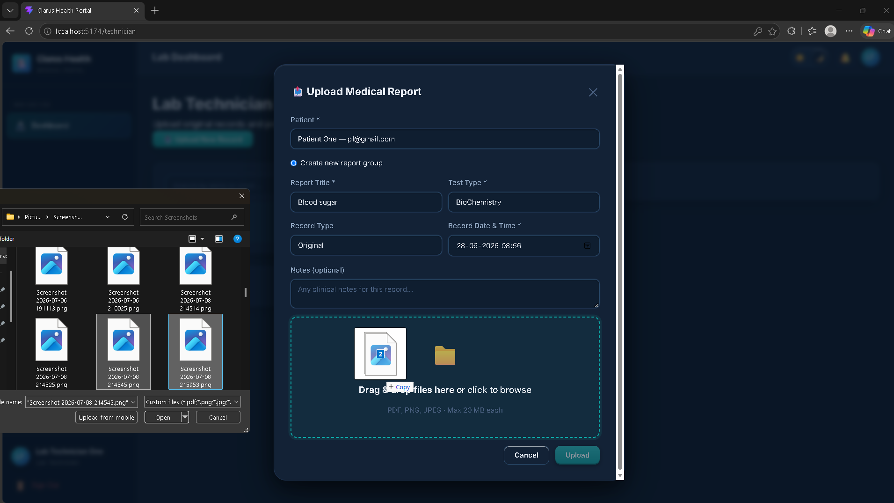
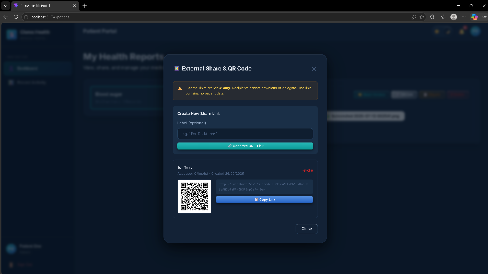
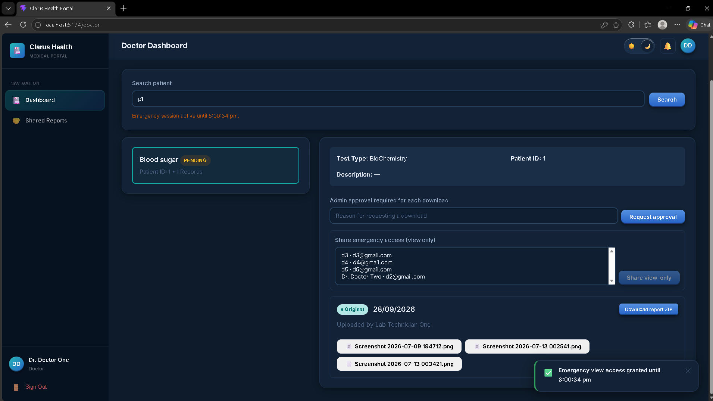
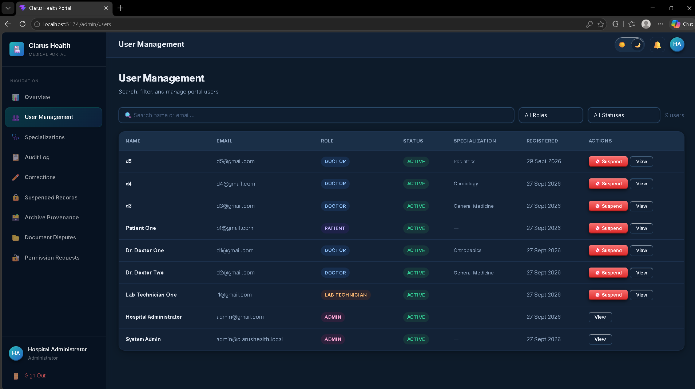

# Clarus Health Portal

A secure healthcare portal for managing patient medical records, lab uploads, doctor access, approvals, audits, corrections, and document sharing.

GitHub: https://github.com/Sanjay17-cmd/Clarus-Health-Portal

This project is used to manage patient records in a local clinical environment where:
- patients can upload and view their reports,
- lab technicians can upload medical documents,
- doctors can access authorized records,
- admins review approvals, disputes, and audit actions,
- sensitive files are protected with role-based and record-based access checks.

---

## Why this project exists

Clarus Health Portal is built for secure healthcare data handling in a local environment without depending on cloud services. It helps organizations manage:
- patient report records,
- doctor access permissions,
- lab technician reporting workflows,
- document export and archive handling,
- correction and dispute processes,
- audit logs for accountability.

It is a practical clinical record management system with a full-stack architecture, role segregation, and local storage.

---

## Key features

- Admin approval workflow for users and doctors
- Patient and technician record management
- Doctor access control by patient/record/group permissions
- External QR-based and share-link access (read-only)
- PDF and image viewing inside the app
- Correction and deletion request flow
- ZIP export/import for archived patient records
- Dispute and break-glass emergency handling
- Audit logging and activity tracking
- Local MySQL + local file storage setup for development and demos

---

## Architecture



### Full permission flow

The important idea is that this system does not simply trust the frontend. Every action flows through the backend, where access is checked before any data is read or written.

1. User logs in from the frontend.
2. The frontend sends a JWT token with each request.
3. The backend validates the token and user status.
4. The backend checks the user's role and permissions.
5. The service decides if the user owns the record, is assigned by share, is an admin, or is allowed under emergency rules.
6. The backend reads or writes metadata in MySQL and reads or writes actual files in the upload storage.
7. Audit entries are created for accountability.

### Permission examples

| Action | Who can do it | Condition |
|---|---|---|
| Register user | Anyone | New user account |
| Admin approval | Admin | User must be pending |
| Upload report | Lab Technician | Must be assigned to patient / valid role |
| View patient file | Patient / Doctor / Admin | Must have permission or ownership |
| Share record with doctor | Patient | Must own the record/group |
| Download external shared file | External viewer | Only if share allows it, usually view-only |
| Approve dispute | Admin | Must review dispute and accept or reject |
| Break-glass access | Doctor / Admin | Valid emergency reason and approval flow |
| Delete or restore record | Patient / Admin / Technician depending on flow | Requires request and review |

### Data transfer map

| Data | Sent from | Sent to | Storage | Controlled by |
|---|---|---|---|---|
| Login request | Browser | Backend API | None | JWT validation |
| User profile | Backend | MySQL | Database | Authentication layer |
| Upload file | Browser | Backend | Local storage | File access layer |
| File metadata | Backend | MySQL | Database | Service logic |
| Share request | Frontend | Backend | MySQL | Patient ownership |
| View permission | Backend | MySQL | Database | Role and share checks |
| Audit entry | Backend | MySQL | Database | Audit layer |
| ZIP export | Backend | Frontend | Local generated archive | Access control + record scope |
| QR share | Backend | Frontend / patient | MySQL + QR payload | Share validity |

### Why this architecture matters

This project is designed around a security-first model:
- the frontend is only a presentation layer,
- the backend is the enforcement layer,
- MySQL stores structured data,
- the local filesystem stores binary health documents,
- permissions are checked before every file or record action.

This ensures that even if a user manipulates the browser, the backend still decides whether access is allowed.

---

## Tech stack

| Layer | Technology |
|---|---|
| Frontend | React, Vite, Axios |
| Backend | FastAPI, SQLAlchemy, Pydantic |
| Auth | JWT + bcrypt |
| Database | MySQL 8 |
| File storage | Local filesystem |
| File types | PDF, PNG, JPG |
| Extras | QR code generation, PDF viewer |

---

## Project structure

```text
Clarus-Health-Portal/
├── backend/
│   ├── core/
│   ├── models/
│   ├── routers/
│   ├── schemas/
│   ├── services/
│   ├── storage/
│   ├── uploads/
│   ├── config.py
│   ├── database.py
│   ├── main.py
│   ├── requirements.txt
│   └── .env
├── database/
│   ├── phase1_schema.sql
│   ├── phase2_schema.sql
│   ├── phase3A_schema.sql
│   ├── phase3B_schema.sql
│   ├── phase4_schema.sql
│   └── phase5_schema.sql
├── frontend/
│   ├── src/
│   ├── index.html
│   ├── package.json
│   ├── package-lock.json
│   └── vite.config.js
├── README.md
└── .gitignore
```

---

## Prerequisites

Before running the project, install:
- Python 3.11+
- Node.js 18+
- MySQL 8+
- Git

---

## First-time setup

### 1) Create the MySQL database

Open MySQL and create a database named:

```sql
CREATE DATABASE clarus_health;
USE clarus_health;
```

### 2) Run SQL files in order

Run these scripts in sequence from the project root:

```bash
mysql -u root -p clarus_health < database/phase1_schema.sql
mysql -u root -p clarus_health < database/phase2_schema.sql
mysql -u root -p clarus_health < database/phase3A_schema.sql
mysql -u root -p clarus_health < database/phase3B_schema.sql
mysql -u root -p clarus_health < database/phase4_schema.sql
mysql -u root -p clarus_health < database/phase5_schema.sql
```

Important:
- use the same database name configured in backend `.env`
- run them in the exact order listed above
- if using MySQL Workbench, open each SQL file one by one and execute in the same order

### 3) Configure backend environment

Create a file named `backend/.env` with:

```env
DB_HOST=localhost
DB_PORT=3306
DB_NAME=clarus_health
DB_USER=root
DB_PASSWORD=your_mysql_password
JWT_SECRET_KEY=change_this_to_a_strong_secret
JWT_ALGORITHM=HS256
JWT_ACCESS_TOKEN_EXPIRE_MINUTES=60
APP_ENV=development
ALLOWED_ORIGINS=http://localhost:5173
UPLOAD_DIR=uploads
MAX_FILE_SIZE_MB=20
EXTERNAL_BASE_URL=http://localhost:5173
```

### 4) Install backend dependencies

```bash
cd backend
python -m venv venv

# Windows
venv\Scripts\activate

# Linux/macOS
source venv/bin/activate

pip install -r requirements.txt
```

### 5) Start backend

```bash
cd backend
venv\Scripts\activate
uvicorn main:app --reload --host 0.0.0.0 --port 8000
```

Backend API docs will be available at:
- http://localhost:8000/docs
- http://localhost:8000/redoc

### 6) Install frontend dependencies

```bash
cd frontend
npm install
```

### 7) Start frontend

```bash
cd frontend
npm run dev
```

Frontend will run at:
- http://localhost:5173

---

## Regular usage

After the first setup, use this flow each time:

### Start backend

```bash
cd backend
venv\Scripts\activate
uvicorn main:app --reload --host 0.0.0.0 --port 8000
```

### Start frontend

```bash
cd frontend
npm run dev
```

### Open app

Visit:
- http://localhost:5173

### Common role flow

1. Register a patient/admin/doctor/technician
2. Admin approves users
3. Technician uploads patient medical files
4. Patient shares access with doctors
5. Doctors view authorized records
6. Admin resolves disputes and reviews audit events

---

## User roles and responsibilities

| Role | Main purpose |
|---|---|
| Admin | User approval, disputes, audits, security actions |
| Patient | Manage reports, share records, view activity |
| Doctor | Access approved patient data and shared records |
| Lab Technician | Upload reports and create records |

---

## Database and file storage notes

### MySQL
The database is the source of truth for:
- user profiles and roles,
- patient groups and records,
- file metadata,
- approvals and access rules,
- audit logs,
- disputes and emergency requests.

### Local file storage
Files uploaded by users are stored under:
- `backend/uploads/reports/...`
- `backend/uploads/imports/...`
- `backend/uploads/quarantine/...`

These files are not directly exposed as public static assets. The backend controls access before serving them.

---

## Security model

- JWT-based authentication
- Role-based authorization checks
- bcrypt password hashing
- Suspended or disabled users are blocked
- File access is validated per record and permission
- Emergency access is restricted and logged
- ZIP import validates metadata and prevents path traversal issues

## Sharing and break-glass protocols

### Internal and group sharing
- Patients can share records or groups with doctors.
- Sharing is granted only to authorized users and only within valid record scope.
- Group-based sharing supports version-aware record and file selection.
- Access can be updated or revoked by the patient at any time.

### External share links
- QR or direct share links are generated for public or external access.
- These are read-only links and are not meant for unrestricted downloads.
- Access is validated by token and share metadata before content is served.

### Break-glass access
- Break-glass is an emergency access workflow for critical patient care situations.
- A doctor or admin must provide a valid justification and approval path.
- Temporary access is logged and restricted to emergency viewing rules.
- Download permission is not granted in normal break-glass flow unless the approval workflow explicitly allows it.
- Access is limited in time and subject to audit review.

### Audit and compliance
- Every major action is recorded in an audit table.
- File access, share updates, disputes, and administrative decisions are traceable.
- This supports accountability and patient safety review.

---

## Screenshots

<div align="center">

<h2>Lab Technician Upload</h2>


<h2>Patient Record Sharing</h2>


<h2>Doctor Break-Glass & Audit Review</h2>



</div>

---

## Important notes

- This project is designed for local/demo deployment, not production cloud deployment.
- It uses local file storage and local MySQL.
- It is a healthcare record management portal focused on secure access and auditability.
- The system is best suited for academic, demo, portfolio, and internal project use.

---

## License

This project is intended for learning, demonstration, and internal development use unless a separate license is added later.

---

## Summary

Clarus Health Portal is a patient healthcare record management system built using React + FastAPI + MySQL. It covers registration, authorization, report uploads, doctor access permissions, document sharing, correction and dispute workflows, admin review, and secure local file handling.
